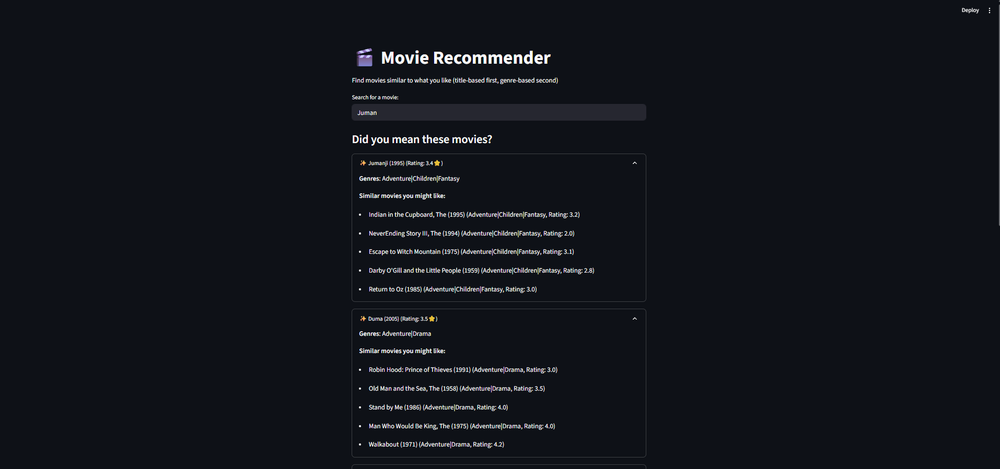
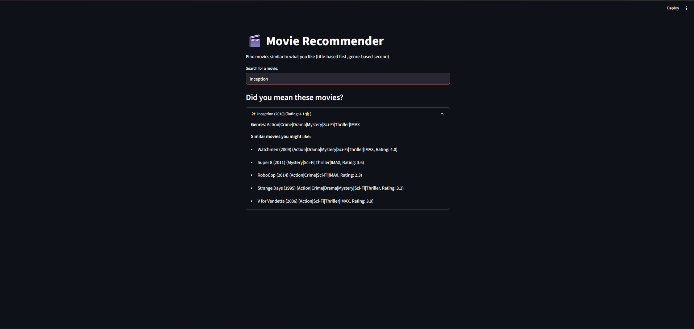

# Movie Recommender System

This is a simple movie recommender system built with Flask. It loads movie and rating data from CSV files and provides a web interface.

## Project Structure

```
movie-recommender/
│
├── app.py          # Main Flask application
├── movies.csv      # Movie metadata
├── ratings.csv     # User ratings
└── README.md       # Project documentation
```
## Demo

Below are screenshots of the Movie Recommender in action:

### Example 1: Searching for "Jumanji"



### Example 2: Searching for "Inception"



## How to Run

1. Make sure you have Python 3 and pip installed.
2. Install dependencies:
   ```bash
   pip install pandas numpy scikit-learn streamlit
   ```
3. Run the app:
   ```bash
   streamlit run app.py
   ```
4. Open your browser and go to `http://127.0.0.1:8501/`.

## Data
- `movies.csv`: Contains movie information (e.g., movieId, title, genres).
- `ratings.csv`: Contains user ratings (e.g., userId, movieId, rating, timestamp). 
